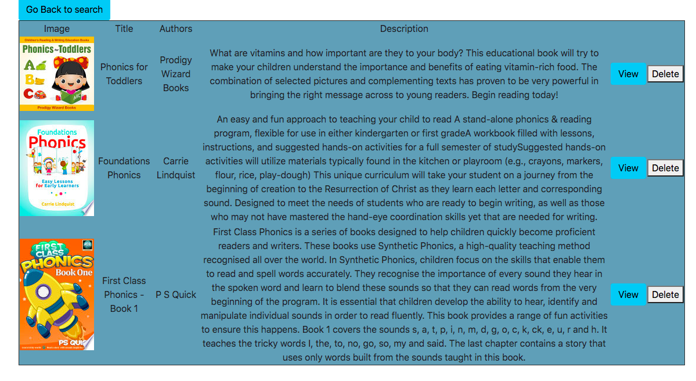
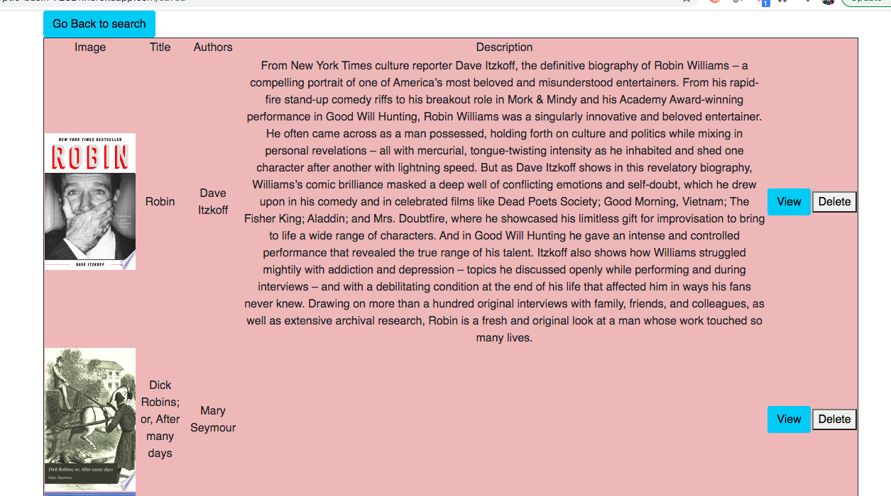

## License

# Create React Express App
This is a React-based Google Books Search app. This create React components, work with helper/util functions, and utilize React lifecycle methods to query and display books based on user searches. We used Node, Express and MongoDB so that users can save books to review or purchase later.

# Use
To run the app locally 
* Run 'npm i' to install all the dependencies 
* Run 'npm start' app will run on PORT 3001!

# Deployment

Link to the deployed website:  https://cryptic-basin-72321.herokuapp.com/

## Below is the screen short for the website after search

## Technologies used
* Node
* Express
* MongoDB 
* Mongoose
* React 

### Contact Detail 
Email-Id : deeapaligarg.chd@gmail.com